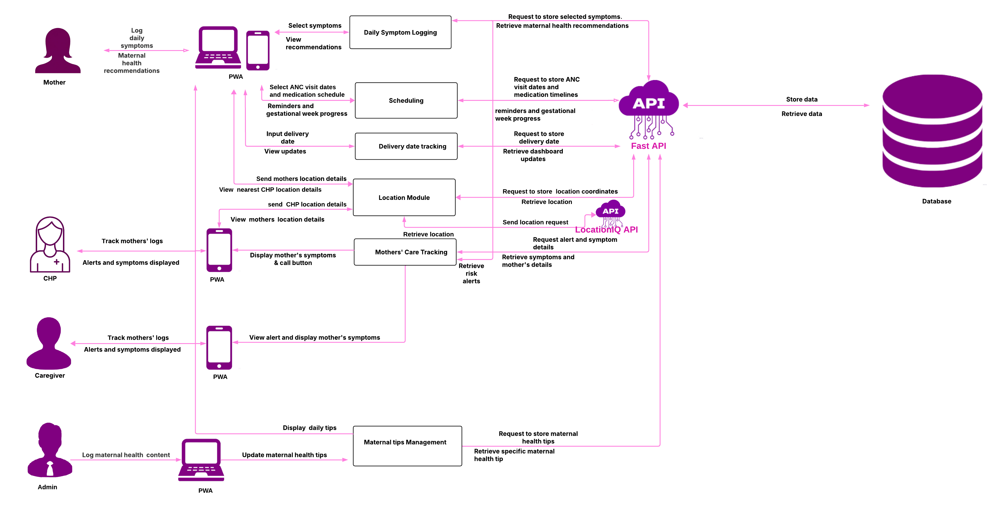

# Bloom System Architecture



## 1. Architecture Overview

Bloom uses a client-server architecture. The mobile application and administrative dashboard communicate with the Bloom backend through APIs, while the backend handles communication with the PostgreSQL database.

The Bloom platform consists of:

- **Bloom Mobile Application**
- **Bloom Administrative Dashboard**
- **Bloom Backend API**
- **PostgreSQL Database**
- **Bloom Informational Website**

The mobile application is used by mothers, caregivers, and Community Health Promoters (CHPs). The administrative dashboard is used by administrators to manage and monitor the platform.

---

## 2. System Components

### 2.1 Mobile Application

The Bloom mobile application provides role-specific functionality for mothers, caregivers, and Community Health Promoters.

The application communicates with the backend through the API and includes functionality such as:

- User authentication
- Maternal profile management
- Daily symptom logging
- Maternal health recommendations
- Care scheduling
- Reminders
- Delivery date tracking
- Location functionality
- Caregiver functionality
- CHP functionality
- Maternal health tips
- Alerts and notifications

The mobile application does not connect directly to the PostgreSQL database. Data is exchanged through the backend API.

---

### 2.2 Administrative Dashboard

The administrative dashboard is the web interface used by Bloom administrators.

The dashboard currently contains the following areas:

```text
admin/
│
├── account-settings/
│
├── auth/
│   └── login/
│
├── content-management/
│
├── metrics/
│   ├── growth-and-engagement/
│   └── safety-and-alerts/
│
└── users-management/
```

The dashboard communicates with the backend API for the data and operations required by these areas.

---

### 2.3 Backend API

The Bloom backend is built with **FastAPI** and provides the API layer for the mobile application and administrative dashboard.

The backend handles:

- API requests
- Authentication and authorization
- User management
- Maternal profile management
- Symptom management and logging
- Care schedules
- Maternal health tips
- Location management
- Analytics
- Database operations
- Email functionality
- Distance calculations
- Security and request handling

The backend communicates with PostgreSQL for persistent data storage.

The detailed backend structure and API functionality are documented in [Backend API](backend-api.md).

---

### 2.4 PostgreSQL Database

Bloom uses **PostgreSQL** for persistent data storage.

The database contains information used by the platform, including:

- Users
- Maternal profiles
- Locations
- Symptoms
- Symptom log items
- Care schedules
- Maternal health tips
- Data used for analytics

The backend is responsible for database access. The mobile application and administrative dashboard do not access PostgreSQL directly.

More information about the database is available in [Database](database.md).

---

### 2.5 Informational Website

The Bloom informational website is the public-facing website for the project.

It provides information about Bloom, its purpose, and the services provided by the platform.

The informational website is separate from the authenticated administrative dashboard and the Bloom mobile application.

**Informational Website:**

[Visit the Bloom Informational Website →](https://bloom-rho-sand.vercel.app/)

---

## 3. How the Components Connect

The main communication path within Bloom is:

```text
Bloom Mobile Application
          │
          │ API requests
     Bloom Backend
          │
          │ Database operations
      PostgreSQL
```

The administrative dashboard uses the same backend:

```text
Administrative Dashboard
          │
          │ API requests
     Bloom Backend
          │
          │ Database operations
      PostgreSQL
```

The informational website is publicly accessible and operates separately from the authenticated applications.

---

## 4. Backend Architecture

The backend is organized into separate areas for API routes, application logic, data access, schemas, and database models.

At a high level:

```text
API Request
    │
  Router
    │
  Service
    │
Repository / Database
    │
PostgreSQL
```

This structure keeps the API routes separate from the application logic and database access.

The backend also contains shared functionality for configuration, security, rate limiting, email functionality, distance calculations, and dependencies.

The complete backend file structure is documented in [Backend API](backend-api.md).

---

## 5. Mobile API Integration

The mobile application uses the Bloom API to communicate with the backend.

API integration is used for operations including:

- Authentication
- User information
- Maternal profile creation and updates
- Symptom logging
- Symptom information
- Care schedules
- Maternal health tips
- Location information
- Alerts and relevant maternal information

The mobile application's API services handle communication between the Flutter application and the backend.

Further details about the mobile application are available in [Mobile Application](mobile.md).

---

## 6. Dashboard API Integration

The administrative dashboard communicates with the Bloom backend through the API.

The API supports dashboard functionality including:

- Administrator authentication
- User management
- Content management
- Growth and engagement metrics
- Safety and alerts
- Account settings

The dashboard does not access the database directly.

Further details are available in [Administrative Dashboard](frontend-web.md).

---

## 7. User Data Flow

For mobile users, the general flow is:

```text
Mother / Caregiver / CHP
          │
     Mobile App
          │
     Bloom API
          │
     PostgreSQL
```

For administrators:

```text
Administrator
      │
Admin Dashboard
      │
  Bloom API
      │
  PostgreSQL
```

This provides a single backend layer through which application data is processed and stored.

---

## 8. Location Data

Location functionality is handled through the backend API.

The general flow is:

```text
Mobile Application
        │
        │ Location data
   Location API
        │
 Location Service
        │
    Database
```

The backend also contains distance calculation functionality used where location-based calculations are required.

---

## 9. Maternal Information and Alerts

Maternal information entered through the mobile application is sent to the backend for processing and storage.

For example, symptom information follows the general flow:

```text
Mother
  │
  │ Records symptoms
Mobile Application
  │
  │ API request
Bloom Backend
  │
  ├── Symptom processing
  ├── Maternal data processing
  └── Relevant alert information
  │
PostgreSQL
```

Relevant information can then be made available to authorized users through the appropriate application functionality.

---

---

## 10. Architecture Principles

### Separation of Responsibilities

The mobile application, dashboard, backend, and database each have their own responsibilities.

### Centralized API

The mobile application and dashboard communicate with the backend through APIs rather than connecting directly to the database.

### Role-Based Access

Bloom provides different functionality for mothers, caregivers, CHPs, and administrators.

### Centralized Data Storage

Application data is stored in PostgreSQL and accessed through the backend.

### Modular Backend

The backend separates routers, services, repositories, schemas, and models so that different parts of the application can be maintained independently.

---
