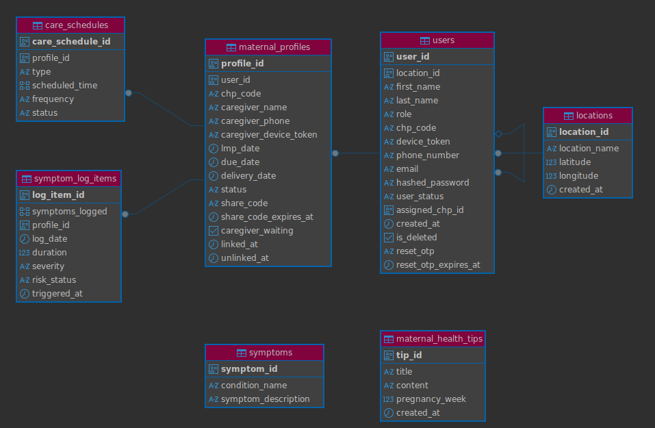

# Database

## 1. Overview

Bloom uses PostgreSQL as its primary database.

The database stores the information required by the mobile application, administrative dashboard and backend services.

Client applications do not connect directly to PostgreSQL. Database access is handled by the Bloom backend.

```text
Bloom Mobile Application

       |

       | API requests

       |

   Bloom Backend

       |

       | Database operations

       |

   PostgreSQL
```

The administrative dashboard follows the same approach:

```text
Administrative Dashboard

       |

       | API requests

       |

   Bloom Backend

       |

       | Database operations

       |

   PostgreSQL
```

---

## 2. Entity Relationship Diagram

The following ERD shows the main database entities and their relationships.



---

## 3. Database Access

The backend is responsible for communication with PostgreSQL.

The database-related functionality is located in the backend, with `database.py` providing the database functionality used by the application.

The backend uses the database models and application services to work with stored information.

The general flow is:

```text
API Request

       |

       |

     Router

       |

       |

    Service

       |

       |

   Database

       |

       |

   PostgreSQL
```

This keeps database access within the backend rather than exposing the database directly to client applications.

---

## 4. SQL Operations

PostgreSQL is used to store and retrieve Bloom application data. The backend can perform common SQL operations such as `SELECT`, `INSERT INTO`, `UPDATE`, and `DELETE`.

### SELECT

The `SELECT` statement is used to retrieve data from a table.

```sql
SELECT *
FROM users;
```

To retrieve specific columns:

```sql
SELECT id, email, role
FROM users;
```

### WHERE

The `WHERE` clause is used to filter records.

```sql
SELECT *
FROM users
WHERE role = 'mother';
```

Another example using a maternal profile:

```sql
SELECT *
FROM maternal_profiles
WHERE user_id = 1;
```

### INSERT INTO

The `INSERT INTO` statement is used to add a new record.

```sql
INSERT INTO users (email, role)
VALUES ('mother@example.com', 'mother');
```

### UPDATE

The `UPDATE` statement is used to modify existing records.

```sql
UPDATE users
SET role = 'caregiver'
WHERE id = 1;
```

### DELETE

The `DELETE` statement is used to remove a record.

```sql
DELETE FROM users
WHERE id = 1;
```

### ORDER BY

`ORDER BY` is used to sort query results.

```sql
SELECT *
FROM symptom_log_items
ORDER BY created_at DESC;
```

### LIMIT

`LIMIT` restricts the number of records returned.

```sql
SELECT *
FROM maternal_profiles
LIMIT 10;
```

### COUNT

`COUNT` can be used to calculate the number of records.

```sql
SELECT COUNT(*) AS total_users
FROM users;
```

### JOIN

`JOIN` can be used to retrieve related information from multiple tables.

```sql
SELECT users.email, maternal_profiles.id
FROM users
JOIN maternal_profiles
    ON users.id = maternal_profiles.user_id;
```

These SQL operations are handled by the backend database layer rather than being executed directly by the mobile application or administrative dashboard.

---

## 5. Main Data Areas

The Bloom backend contains models for the main types of information used by the platform.

```text
Database

|

|-- Users

|-- Locations

|-- Maternal Profiles

|-- Symptoms

|-- Symptom Log Items

|-- Care Schedules

\-- Maternal Health Tips
```

These areas correspond to the database models in the backend.

---

## 6. User Data

User information is represented by the `user.py` model.

User data is used by the platform to support the different user roles and their associated functionality.

User-related operations are exposed through the user router and handled through the user service.

```text
User Request

       |

       |

   user.py

       |

       |

user_service.py

       |

       |

   Database
```

---

## 7. Location Data

Location information is represented by the `location.py` model.

Location functionality is used by the platform where location information is required.

The backend also contains `distance.py`, which provides distance calculation functionality.

Location-related requests are handled through the location router and location service.

```text
Location Request

       |

       |

 location.py

       |

       |

location_service.py

       |

       |

   Database
```

---

## 8. Maternal Profile Data

Maternal profile information is represented by the `maternal_profile.py` model.

The maternal profile stores information associated with a mother's profile within the Bloom platform.

Maternal profile operations are handled through the maternal profile router and service.

```text
Maternal Profile Request

       |

       |

maternal_profile.py

       |

       |

maternal_profile_service.py

       |

       |

    Database
```

---

## 9. Symptom Data

Bloom separates symptom information from individual symptom log entries.

The `symptom.py` model represents symptom information, while `symptom_log_item.py` represents individual entries recorded in a symptom log.

The corresponding routers and services handle these two areas.

```text
Symptom Information

       |

       |

   symptom.py

       |

       |

 symptom_service.py
```

Individual symptom log entries follow:

```text
Symptom Log Entry

       |

       |

symptom_log_item.py

       |

       |

symptom_log_item_service.py
```

The resulting data is stored through the backend's database layer.

---

## 10. Care Schedule Data

Care schedule information is represented by the `care_schedule.py` model.

Care schedule operations are handled through the care schedule router and service.

```text
Care Schedule Request

       |

       |

care_schedule.py

       |

       |

care_schedule_service.py

       |

       |

    Database
```

This allows care schedule information to be managed through the Bloom API.

---

## 11. Maternal Health Tips

Maternal health tip information is represented by the `maternal_tip.py` model.

The corresponding router and service provide the API and application logic for maternal health tips.

```text
Maternal Tip Request

       |

       |

maternal_tip.py

       |

       |

maternal_tip_service.py

       |

       |

    Database
```

---

## 12. Analytics Data

Analytics functionality is handled by the backend through:

```text
routers/

|

\-- analytics.py
```

and:

```text
services/

|

\-- analytics_service.py
```

Analytics-related information is processed through the backend rather than being retrieved directly by the dashboard from PostgreSQL.

The administrative dashboard communicates with the backend API when accessing analytics functionality.

---

## 13. Database Models

The database models currently documented in the backend are:

```text
models/

|

|-- user.py

|-- location.py

|-- maternal_profile.py

|-- symptom.py

|-- symptom_log_item.py

|-- care_schedule.py

\-- maternal_tip.py
```

Each model represents a particular area of information used by Bloom.

The models are part of the backend's data layer and are used when working with information stored in PostgreSQL.

---

## 14. Data Access Flow

Bloom uses the backend as the central point for database access.

For mobile users:

```text
Mother / Caregiver / CHP

       |

       |

   Mobile App

       |

       |

   Bloom API

       |

       |

   Backend

       |

       |

 PostgreSQL
```

For administrators:

```text
Administrator

       |

       |

Admin Dashboard

       |

       |

   Bloom API

       |

       |

   Backend

       |

       |

 PostgreSQL
```

This means that database operations are handled by the backend regardless of which client application initiated the request.

---

## 15. Database Configuration

Database configuration is handled by the backend.

The backend's `database.py` file contains the database functionality, while configuration values required by the application are provided through the project's environment configuration.

The backend environment should be configured using the variables provided in `.env.example`.

Sensitive database credentials should not be committed to the repository.

---

## 16. Database and API Separation

The PostgreSQL database is not exposed directly to the mobile application or administrative dashboard.

Instead, requests pass through the backend API.

```text
Mobile Application

       |

       |

Administrative Dashboard

       |

       |

   Bloom API

       |

       |

   Backend

       |

       |

   PostgreSQL
```

This keeps database operations within the backend and provides a single point through which application data is accessed and managed.

---
